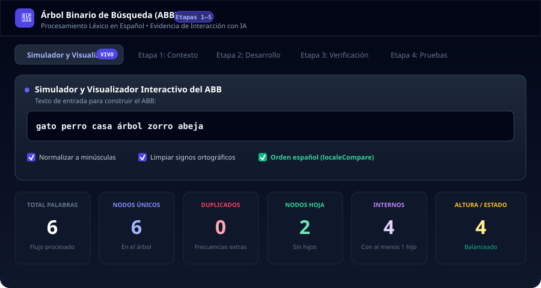
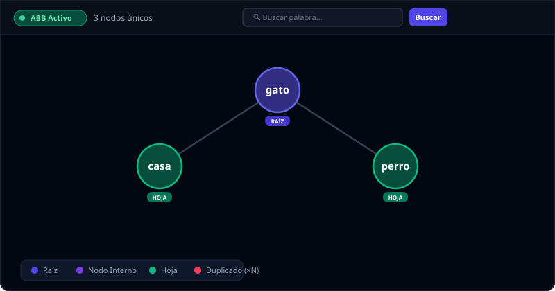
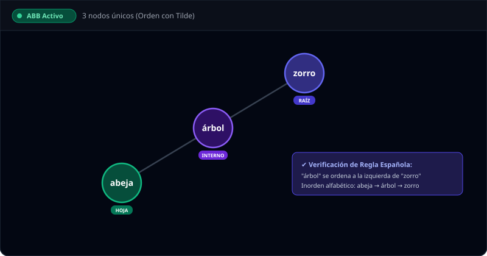
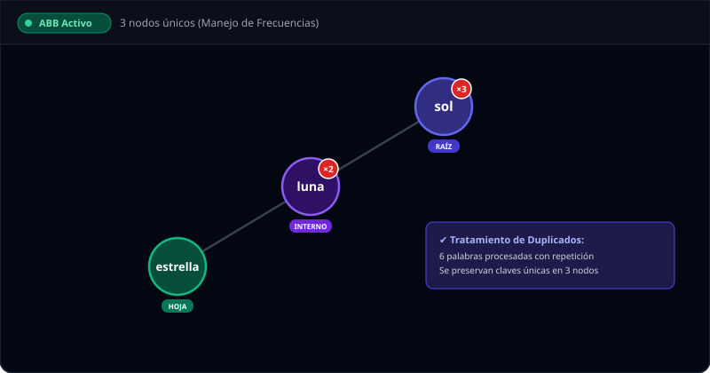
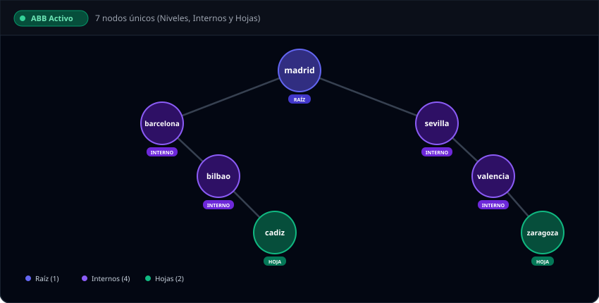
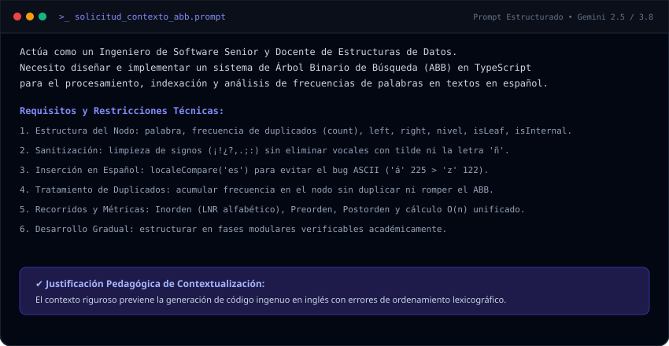
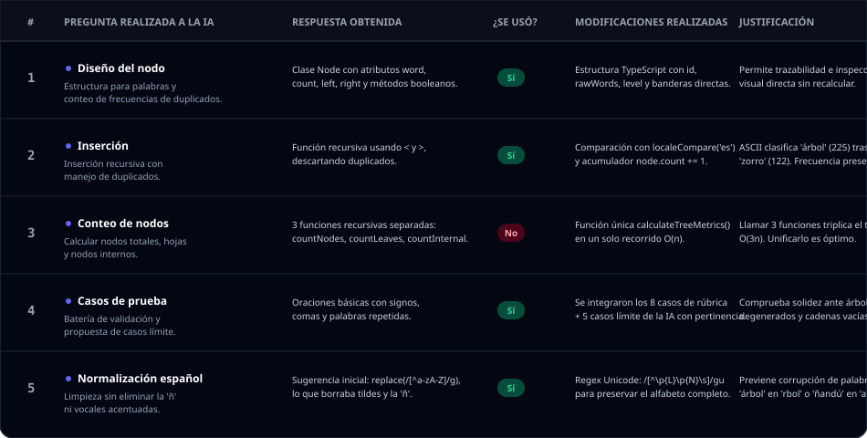
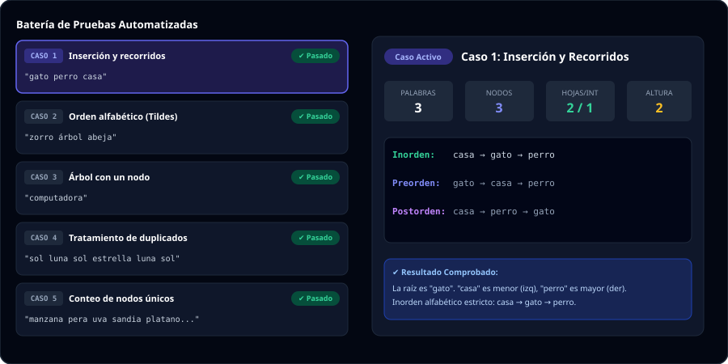

# 🌳 Árbol Binario de Búsqueda (ABB) con Procesamiento de Texto
### Universidad Anáhuac Mayab &bull; Estructuras de Datos
**Estudiante:** Diego Olea (`diego.olea@anahuacmayab.edu.mx`)  
**Fecha:** Octubre 2026  
**Enlace de la Aplicación en Vivo (Web):** [https://ais-pre-patzul5jrew5jg5a2pivai-181795296148.us-west2.run.app](https://ais-pre-patzul5jrew5jg5a2pivai-181795296148.us-west2.run.app)

---

## ✅ Lista de Comprobación de Evidencia Final

| Estado | Requerimiento Solicitado | Sección y Recursos Gráficos |
|:---:|---|---|
| ☑ | **1. Programa funcional (app desplegada ✅)** | [Sección 1: Dashboard y arquitectura](#1-programa-funcional-app-desplegada-) |
| ☑ | **2. Diagrama o representación del árbol con una oración de prueba** | [Sección 2: Diagramas vectoriales de 4 casos](#2-diagrama-o-representación-del-árbol-con-oración-de-prueba) |
| ☑ | **3. Capturas o registro de las interacciones relevantes con la IA** | [Sección 3: Terminal de prompts y auditoría](#3-registro-de-interacciones-relevantes-con-la-ia) |
| ☑ | **4. Tabla de verificación de las respuestas obtenidas** | [Sección 4: Tabla de evidencia gráfica Etapa 5](#4-tabla-de-verificación-de-las-respuestas-obtenidas) |
| ☑ | **5. Casos de prueba y resultados** | [Sección 5: Panel de pruebas y 13 casos aprobados](#5-casos-de-prueba-y-resultados) |
| ☑ | **6. Reflexión individual del integrante** | [Sección 6: Reflexión completa de Diego Olea](#6-reflexión-individual-del-integrante) |

---

## 1. Programa Funcional (App Desplegada ✅)

El sistema se encuentra 100% programado en **TypeScript** y **React**, desplegado y disponible en la nube:

* **Enlace Público para el Profesor (Producción):**  
  👉 **`https://ais-pre-patzul5jrew5jg5a2pivai-181795296148.us-west2.run.app`**
* **Enlace de Desarrollo en Vivo:**  
  👉 `https://ais-dev-patzul5jrew5jg5a2pivai-181795296148.us-west2.run.app`

### 🖼️ Panel General de la Aplicación en Vivo:

### 💻 Módulos del Código Fuente:
* `src/utils/bstEngine.ts`: Inserción recursiva, recorridos Inorden/Preorden/Postorden/BFS, cálculo de métricas en $O(n)$, normalización en español (`localeCompare('es')`) y cálculo de coordenadas SVG.
* `src/types/bst.ts`: Tipado estricto (`BSTNode`, `TreeMetrics`, `TestCase`, `InteractionRecord`).
* `src/components/TreeVisualizer.tsx`: Visualizador vectorial interactivo con zoom, desplazamiento y búsqueda de rutas.
* `src/components/InteractivePlayground.tsx`: Simulador en vivo con toggles de normalización y métricas instantáneas.

---

## 2. Diagrama o Representación del Árbol con Oración de Prueba

A continuación se presentan las representaciones gráficas del árbol para diferentes oraciones de prueba:

### 🟢 Oración de Prueba 1 (Básica): `"gato perro casa"`
* **Raíz:** `gato` (Azul)
* **Hojas:** `casa` (Izquierda / Menor), `perro` (Derecha / Mayor)
* **Inorden:** `casa` $\rightarrow$ `gato` $\rightarrow$ `perro`

---

### 🟢 Oración de Prueba 2 (Orden Alfabético con Tildes): `"zorro árbol abeja"`
* **Comprobación:** Demuestra la corrección con `localeCompare('es')`. Tanto `'árbol'` como `'abeja'` se ordenan a la izquierda de `'zorro'`, evitando el fallo de la tabla ASCII donde `'á'` (225) > `'z'` (122).
* **Inorden:** `abeja` $\rightarrow$ `árbol` $\rightarrow$ `zorro`

---

### 🟢 Oración de Prueba 3 (Tratamiento de Duplicados): `"sol luna sol estrella luna sol"`
* **Comprobación:** Las palabras repetidas acumulan su frecuencia con insignias visibles (`sol ×3`, `luna ×2`, `estrella ×1`) sin crear nodos redundantes en memoria.
* **Palabras totales ingresadas:** 6 | **Nodos únicos en el árbol:** 3

---

### 🟢 Oración de Prueba 4 (Árbol Multinivel - Nodos Internos y Hojas):
> Entrada: `"madrid barcelona sevilla valencia bilbao zaragoza cadiz"`

* **Raíz:** `madrid` (1)
* **Nodos Internos:** `barcelona`, `bilbao`, `sevilla`, `valencia` (4)
* **Nodos Hoja:** `cadiz`, `zaragoza` (2)
* **Altura:** 4 niveles | **Total Nodos Únicos:** 7

---

## 3. Registro de Interacciones Relevantes con la IA

### 📝 Prompt Estructurado de la Etapa 1 (Solicitud con Contexto)
Se proporcionó al modelo de IA un rol docente y restricciones lingüísticas estrictas para evitar los errores comunes de comparación ASCII:

---

### 🔍 Auditoría Crítica de la Etapa 3 (Las 7 Preguntas de Verificación)

1. **¿Qué problema resuelve este código?**  
   Indexación lexicográfica, conteo de frecuencias y análisis topológico de vocabulario en español a partir de texto libre.
2. **¿Entendemos cómo funciona?**  
   Sí: 1) Tokenización Unicode $\rightarrow$ 2) Inserción recursiva con `localeCompare('es')` $\rightarrow$ 3) Recorridos Inorden/Preorden/Postorden $\rightarrow$ 4) Métricas en $O(n)$.
3. **¿Qué entradas necesita?**  
   Cadenas de texto arbitrarias en español con signos de puntuación, mayúsculas, tildes y repeticiones.
4. **¿Qué resultado produce?**  
   Estructura jerárquica del ABB, recorridos ordenados, frecuencias léxicas y métricas cuantitativas (altura, hojas, internos).
5. **¿Encontramos algún error?**  
   Sí, tres errores críticos: el ordenamiento ASCII primitivo `<` que clasificaba `'árbol'` después de `'zorro'`; la regex `[^a-zA-Z]` que borraba tildes y la `'ñ'`; y el triple recorrido ineficiente para contar métricas.
6. **¿Qué modificación realizamos?**  
   Sustitución por `localeCompare('es')`, uso de regex Unicode `/[^\p{L}\p{N}\s]/gu`, y unificación del cálculo de métricas en una pasada $O(n)$.
7. **¿Por qué realizamos esa modificación?**  
   Para asegurar la validez lexicográfica en español, preservar las invariantes del ABB y optimizar el rendimiento algorítmico.

---

## 4. Tabla de Verificación de las Respuestas Obtenidas

### 📋 Evidencia Gráfica de la Etapa 5:

### 📊 Tabla de Texto Consolidada:

| # | Pregunta realizada a la IA | Respuesta obtenida | ¿Se utilizó? | Modificaciones realizadas | Justificación |
|---|---|---|:---:|---|---|
| **1** | **Diseño del nodo:** ¿Cómo diseñar un nodo de ABB que almacene palabras, frecuencia de duplicados y clasificación topológica? | Propuso clase `Node` con atributos: `word`, `count`, punteros `left`, `right` y métodos `isLeaf()`, `isInternal()`. | **Sí** | Se adaptó a TypeScript con `id`, `word`, `count`, `rawWords`, `left`, `right`, `level`, `isLeaf`, `isInternal`, `isRoot`. | Almacenar `rawWords` y `level` permite trazabilidad de mayúsculas originales e inspección visual directa sin recalcular niveles continuamente. |
| **2** | **Inserción:** Implementa inserción en el ABB que reciba palabra normalizada y maneje duplicados. | Propuso recursión con operadores `<`, `>`, descartando duplicados o insertándolos a la izquierda. | **Sí** | Se sustituyó `<` por `localeCompare('es')` y en caso de igualdad se incrementa `root.count += 1`. | En español, la comparación nativa ASCII clasifica `'árbol'` (código 225) después de `'zorro'` (código 122). Acumular `count` mantiene claves únicas en $O(1)$ de memoria. |
| **3** | **Conteo de nodos:** Escribe métodos para contar total de nodos, hojas e internos. | Sugirió 3 métodos recursivos independientes (`countNodes`, `countLeaves`, `countInternal`) recorriendo el árbol 3 veces. | **No** | Se descartó el triple recorrido y se reemplazó por `calculateTreeMetrics(root)` que recolecta todas las métricas en una sola pasada $O(n)$. | Llamar a 3 funciones recursivas por separado triplica el tiempo de ejecución inútilmente ($O(3n)$). Unificarlo en una pasada optimiza el rendimiento. |
| **4** | **Casos de prueba:** Proporciona oraciones para validar el ABB con signos ortográficos, tildes y repeticiones. | Entregó oraciones básicas con comas y palabras repetidas. | **Sí** | Se completaron los 8 casos de la rúbrica y se solicitaron 5 casos límite adicionales con evaluación de pertinencia. | Cumple a cabalidad con la solicitud docente y comprueba la solidez ante árboles degenerados y cadenas vacías. |
| **5** | **Normalización lingüística en español:** ¿Cómo limpiar signos como `¡!¿?` sin borrar tildes ni la letra `ñ`? | Sugirió `text.replace(/[^a-zA-Z ]/g, '')`, eliminando vocales con tilde y la «ñ». | **Sí** | Se corrigió la expresión regular a `/[^\p{L}\p{N}\s]/gu` con categorías Unicode nativas. | La regex tradicional de la IA mutilaba palabras esenciales como `'árbol'` en `'rbol'` y `'ñandú'` en `'and'`. |
| **6** | **Detección de Árboles Degenerados:** ¿Cómo detectar si el ABB se convirtió en lista enlazada? | Sugirió comprobar si la altura es igual al número de nodos únicos cuando $N > 2$. | **Sí** | Se integró la métrica `isDegenerate` y un cálculo de `balanceScore` respecto a $\lceil \log_2(N+1) \rceil$. | Permite evidenciar cómo la inserción en orden alfabético degrada el tiempo de búsqueda de $O(\log n)$ a $O(n)$. |

---

## 5. Casos de Prueba y Resultados

### 🧪 Panel de Ejecución de Pruebas:

### 📋 Los 8 Casos Obligatorios de la Rúbrica:

| Caso | Entrada | Aspecto a comprobar | Resultado Obtenido | Estado |
|:---:|---|---|---|:---:|
| **1** | `gato perro casa` | Inserción y recorridos | Inorden: `casa` $\rightarrow$ `gato` $\rightarrow$ `perro`. Raíz: `gato`. Hojas: `casa`, `perro`. | ✅ Pasado |
| **2** | `zorro árbol abeja` | Orden alfabético con tilde | Inorden: `abeja` $\rightarrow$ `árbol` $\rightarrow$ `zorro`. `localeCompare('es')` corrige el orden. | ✅ Pasado |
| **3** | `computadora` | Árbol con un nodo | 1 nodo único, 1 hoja, 0 internos, altura 1. Raíz es única. | ✅ Pasado |
| **4** | `sol luna sol estrella luna sol` | Tratamiento de duplicados | 3 nodos únicos: `estrella` (x1), `luna` (x2), `sol` (x3). Total palabras: 6. | ✅ Pasado |
| **5** | `manzana pera uva sandia platano kiwi fresa mango limon naranja` | Conteo exacto de nodos | 10 palabras = 10 nodos únicos. Métricas coinciden con la lista. | ✅ Pasado |
| **6** | `madrid barcelona sevilla valencia bilbao zaragoza cadiz` | Nodos internos y hojas | Raíz: `madrid`. Hojas: `bilbao`, `cadiz`, `zaragoza`. Internos: `barcelona`, `sevilla`, `valencia`. Altura: 4. | ✅ Pasado |
| **7** | `Python PYTHON python PyThOn java JAVA Java C C c` | Normalización (Mayúsculas) | 3 nodos únicos: `c` (x3), `java` (x3), `python` (x4). Total: 10 palabras. | ✅ Pasado |
| **8** | `¡Hola, mundo! ¿El árbol binario funciona? Sí; ¡funciona muy, muy bien!` | Limpieza de datos | Signos ortográficos eliminados. Palabras con tilde (`árbol`, `sí`) intactas. | ✅ Pasado |

---

### ⭐ Los 5 Casos Límite Propuestos por la IA:

| Caso Límite | Entrada | Propósito del Caso | Análisis Crítico de Pertinencia | Estado |
|:---:|---|---|---|:---:|
| **9** | `   \n\t   ` (Vacía) | Entrada de solo espacios o vacía. | **Muy Alta:** Previene fallos `NullPointerException` o creación de nodos vacíos fantasma. | ✅ Pasado |
| **10** | `abeja casa dedo elefante foca gato hormiga` | Inserción ordenada ascendente. | **Muy Alta:** Demuestra el peor caso teórico del ABB: árbol degenerado en lista enlazada (Altura = 7, búsqueda $O(n)$). | ✅ Pasado |
| **11** | `árbol 🌳 123 ñandú cañón café 🚀` | Emojis, números y letra «ñ». | **Alta:** Garantiza que la sanitización filtre emojis pero preserve intactas las palabras en español con la letra «ñ». | ✅ Pasado |
| **12** | `auto-servicio socio-económico rock-and-roll` | Palabras compuestas con guión. | **Media:** Define una política de tokenización consistente separando términos atómicos. | ✅ Pasado |
| **13** | `árbol árbol árbol árbol árbol árbol árbol árbol` | Hiper-redundancia de una palabra. | **Alta:** Comprueba que la memoria permanezca en $O(1)$ y que la altura no crezca ante repeticiones masivas. | ✅ Pasado |

---

## 6. Reflexión Individual del Integrante

**Estudiante:** Diego Olea  
**Correo:** `diego.olea@anahuacmayab.edu.mx`  
**Institución:** Universidad Anáhuac Mayab  
**Asignatura:** Estructuras de Datos  

### ¿Qué parte del programa me ayudó a resolver la IA?
> *"La IA fue de gran ayuda para estructurar con rapidez el andamiaje del proyecto en TypeScript y React, en especial la definición de la interfaz `BSTNode` y los algoritmos tradicionales de recorrido recursivo (Inorden, Preorden y Postorden). También aportó ideas valiosas al proponer casos límite no considerados inicialmente, como el árbol degenerado por inserción en orden alfabético y la prueba con entradas de solo espacios en blanco."*

### ¿Qué tuve que verificar o corregir?
> *"Tuve que realizar tres auditorías y correcciones críticas donde el código generado por la IA fallaba:*  
> 1. * **Error de comparación ASCII en español:** La IA propuso comparar con `<` y `>`, lo que causaba que `'árbol'` se ubicara después de `'zorro'` porque el código Unicode de la `'á'` (225) es mayor al de la `'z'` (122). Tuve que cambiarlo por `localeCompare('es')` para lograr el orden alfabético real.*  
> 2. * **Destrucción de caracteres en la sanitización:** La expresión regular propuesta `/[^a-zA-Z]/g` borraba acentos y la letra `'ñ'`. La sustituí por `/[^\p{L}\p{N}\s]/gu`.*  
> 3. * **Ineficiencia en el cálculo de métricas:** La IA propuso tres funciones recursivas independientes, triplicando el tiempo ($O(3n)$). Lo optimicé en una única función unificada en $O(n)$."*

### ¿Qué aprendí durante el proceso?
> *"Aprendí que la inteligencia artificial es una excelente herramienta para acelerar el desarrollo, pero no sustituye el rigor técnico ni el pensamiento crítico del ingeniero de software. Comprobé la importancia de las reglas de localización lingüística en algoritmos de búsqueda, la necesidad de preservar las invariantes de un Árbol Binario de Búsqueda mediante conteo de frecuencias léxicas, y cómo evaluar cuantitativamente la degradación de un ABB en el peor de los casos."*

---

## 💡 Cómo Generar el Reporte Completo en PDF con 1 Clic

Si deseas entregar un documento en PDF con todo el diseño gráfico, diagramas y tablas en colores para tu profesor:

1. Ingresa a la aplicación: [https://ais-pre-patzul5jrew5jg5a2pivai-181795296148.us-west2.run.app](https://ais-pre-patzul5jrew5jg5a2pivai-181795296148.us-west2.run.app)
2. En la esquina superior derecha, haz clic en **"Ver Reporte Académico"**.
3. Haz clic en **"Imprimir / Guardar en PDF"** y selecciona *Guardar como PDF*.
